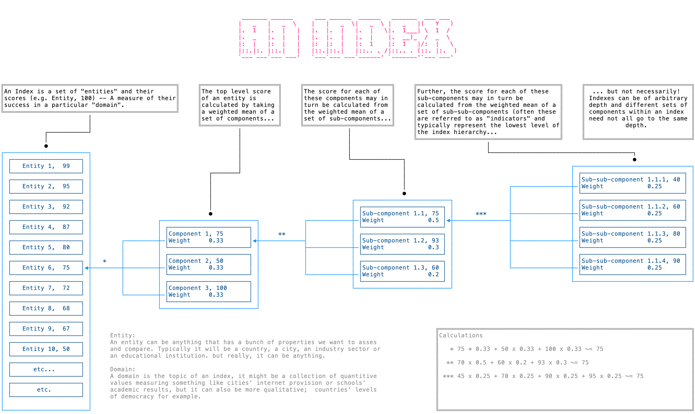

# index-core

This ES module provides a way to calculate an EIU style index [what is an index](#what-is-an-index) from a couple of data sources.

- The first data source defines the index's structure, what indicators are taken into account, the nature of those indicators (min & max value, weighting etc). 
- The second provides data on the entities which are being indexed (cities, countries, schools, companies or whatever) primarily what the entities score on each of the indicators but also may include background detail e.g. a region into which a country is grouped, the address of a hospital, the size of corporation and so on.

These data sources are typically derived from CSV spreadsheets and take the form of two arrays of objects with each object representing the data from one row of the CSV -- this is the default form of Javascript object produced by D3's CSV parser. Example sheets can be found in this repos [data](data) directory.

Let's look at the data sources in more depth!

## Data source: Indicators
[Data source: Indicators]:#data-indicators
Good question! 
Defines the structure and properties of the index
### required
- __id:__ The `id` property of an tells _index-core_ how an indicator fits into the indexes heirachy as well as providing a unique identifier. The `id` takes the form of a string of single dot separated characters. For example if the `id` is `3.2.4` the indicator belongs to group _3_ and subgroup _2_. Similarly `3.2.4.a` belongs to  group _3_, sub-group _2_, sub- sub-group _4_.
- __weighting:__ The `weighting` property defines how much influence an indicator has on the score of its parent group. It is typically expressed as a proportion between 0 and 1 but can be any number. So typically a group of 3 indicators might have `weighting`s `0.33333`,`0.33333`,`0.33333`. Each indicator's value will contribute one-third towards the parent group score. It might be easier to give them weightings `1`,`1`,`1` which will also mean they all contribute an equal amount but usually a 0-1 or 0-100 scheme is preferable as this is typically what the research team uses. 
- __type:__ This is required on indicators who derive their value from sub indicators and should be set to `calculated`. _Future versions may alow other behaviors to be specified, for example inclusion/exclusion catefories._
### optional
- __max:__ (default `100`) The `max` property specifies the maximum numeric value that an indicator can have. Whilst optional it's a good idea to specify this for clarity and most of the time it will be neccesary for the majority of indicators.That said, on `calculated` indicators it has no meaning or effect.
- __min:__ (default `0`) The minimum value that an indicator can take, this is more oftent han not 0.
- __invert:__ (default `false`) Most indicators contribute positively towards the score of their parent group e.g. high literacy rates are considered a good thing so a big number leads to a big score. Sometimes this is not the case for example a high unemployment rate is usually considered a bad thing so we want high number to contribute negatively to the parent group score. This is achieved by setting the `invert` property to `true`.

## Data source: Entities
[Data source: Entites]:#data-entities
Defines the things which are being indexed, the content.
### required
- __name:__ a unique identifier string, this is normally the name of an countrty or city or whatever but can be anything as long as it's unique.
- __indicator properties:__ Each entity in the index needs to have a property for each indicator which belongs to the main index structure named to match the ID (e.g. `1.2.3`, `4.2.3` etc.)
### optional
Everything else. 

There will often be ancillary imformation associated with each entity, things like a description of the entity, some background indicators, or categorisation information. These can all live in the _entities_ sheet.

## API

### indexCore(_indicators:Array_, _entities:Array_, [_indexMax:Number_])

indexCore constructs and calculates an index it returns an `index` object allowing access to results of the calculation for all the entities at a give indicator level, the structure of the index as a whole and methods for adjusting indicator values and weightings. 

__indicators__ is an array of indicator objects. 
```
{
  id:String,
  weighting:Number,
  type:["calculated"|"discrete"|"continuous"]
  max:Number,
  min:Number,
  invert:Bool
}
```

__entities__ is an array of enetity objects
```
{
  name:String
  1.1.1:Number, //eg
  1.1.2:Number,
  etc.
}
```

Take a look at the data source descriptions for a fuller description of the properties these objects might take: [indicators](#data-indicators) [entities](#data-entities)

__indexMax__, optional. is the maximum value for the index score (minimum is always 0) by thefault this is 100, other typical values are 1 and 10.

### indexCore.__indexedData__:Object
An object where each property is an _entity_ in the index and that entity has properties for each of the properties in the indicators spreadsheet _and_ any calculated values.
### indexCore.__indexStructure__:Object
An object representing the structure of the index
### indexCore.__adjustWeight(_indicatorID:String_, _weight:Number_)__
A function that allows the user adjust the weighting of an indicator to give it a greater or lesser importance in theindex as whole. The index is recalculated after calling this function.
### indexCore.__adjustValue(_entityName:String_, _indicatorID:String_, _value:Number_)__
A function that allows the user to adjust an entity's indicator score within the index the index is recalculated using the new value. The index is recalculated after calling this function.

_NOTE: whislt the old value is retained there's currently no way to reset it._
### indexCore.__getIndexMean([indicatorId:String], _[normalise:Boolean=false]_)__:Number
Returns the mean value for a given indicator accross all entities in the index which posses that value. Note that if an indicator does not posses that value it's excluded from the calculation and a sane result should be returned. Providing no _indicatorId_ will result in the mean of the top level index scores being returned. The second argument determines whether the result will be expressed as normalised (which is the default) or in the raw quantities of the indicator. i.e. if an indicator represents the number of hours of sunlight it could be better to express it un-normalised as in the mean number of hours rather than normalised to between e.g. 1-100.


## What _is_ an Index?
[what is an index?]:#what-is-an-index
Good question! 

An Index is a set of _entities_ (cities, countries, educational institutions etc) and associated scores. The scores are a measure of the entities success in a particular domain (effective water usage, institutional democratic accountability, academic results, etc.). They are typically derived from a mix of quantitative factors and qualitative factors.

Examples of indexes include...

 * [The Inclusive Internet Index](https://theinclusiveinternet.eiu.com/) 
 * [The Water Optimisation Index](https://wateroptimization.economist.com/)
 * [The Democracy Index](https://www.eiu.com/n/campaigns/democracy-index-2020/)

Indexes are structured like trees. Each entity's headline score is calculated as the weighted mean of several branches scores which in turn are calculated from the weighted mean of a set of sub-branches and so on until we reach the "leaves" &ndash; indicators which the researchers quantify and score.

